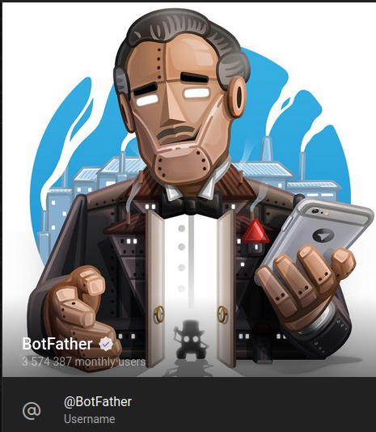
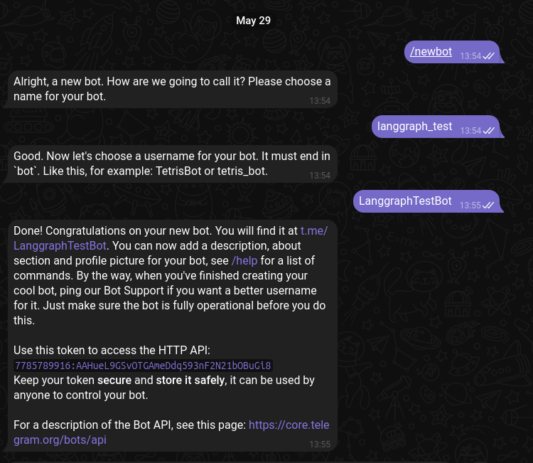

## Для запуска

Для начала нужно создать ботa:  
## шаг 1
Зайти в телеграм и перейти в BotFather  

## шаг2
Создать бота (пример на рисунке)  

## шаг3
Положить подгружаемый документ в папку *fixtures*
## шаг4
Указать настройки окружения в *.env* файле.
```
BOT_TOKEN - токен бота
LANGGRAPH_LANGUAGE_MODEL - основная модель
LANGGRAPH_EMBEDDING_MODEL - модель для эмбединга
LANGGRAPH_TEMPERATURE - температура основной модели
LANGGRAPH_SIMILARITY_SEARCH_K - количество чанков в результате поиска по документам
LANGGRAPH_SEPARATORS - сепараторы для сплиттера, указывать как список (например '["---", "+++"]') 
LANGGRAPH_SPLITTER_CHUNK_SIZE - размер чанка для сплиттера
LANGGRAPH_SPLITTER_CHUNK_OVERLAP - размер перекрытия чанка для сплиттера
LANGGRAPH_DEFAULT_DOC_FILE_PATH - стартовый документ, указать название файла из папки fixtures
```
## шаг4
```bash
docker compose up -d 
```
Возможен флаг *--build*, если мы делали изменения в проекте и нам нужно его пересобрать
## P.S.
Первый запуск может идти долго, так как скачиваются все зависимости и после 
сборки контейнеров скачиваются модели для Ollama. 
Лучше выделить 10+ гб оперативной памяти в ресурсах докера.


